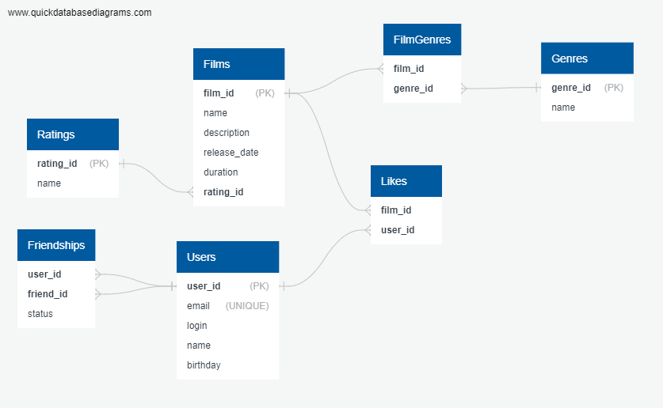

# java-filmorate

## Диаграмма базы данных



## Пояснение к схеме базы данных

Диаграмма базы данных представляет структуру хранения пользователей, фильмов, их жанров, рейтингов и отношений дружбы между пользователями. Основные сущности и их связи спроектированы в третьей нормальной форме (3NF), чтобы избежать дублирования данных и обеспечить целостность информации.

### Основные операции:

- **Получение всех фильмов:**
  ```sql
  SELECT * FROM Films;

- **Получение пользователя по ID:**
  ```sql
  SELECT * FROM Users WHERE user_id = ?;

- **Добавление нового друга:**
  ```sql
  INSERT INTO Friendships (user_id, friend_id, status)
  VALUES (?, ?, 'PENDING');

- **Получение списка общих друзей двух пользователей:**
  ```sql
  SELECT u.*
  FROM Users u
  JOIN Friendships f1 ON u.user_id = f1.friend_id
  JOIN Friendships f2 ON u.user_id = f2.friend_id
  WHERE f1.user_id = ? AND f2.user_id = ?;

- **Получение топ N популярных фильмов:**
  ```sql
  SELECT f.*, COUNT(l.user_id) as likes_count
  FROM Films f
  LEFT JOIN Likes l ON f.film_id = l.film_id
  GROUP BY f.film_id
  ORDER BY likes_count DESC
  LIMIT N;